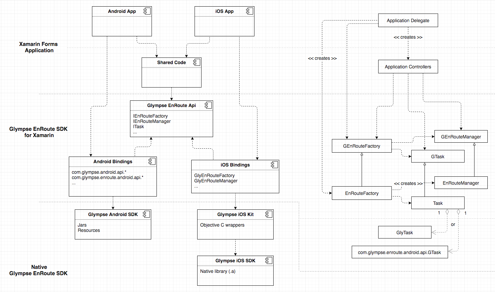

# Glympse EnRoute SDK for Xamarin

## Overview

Glympse EnRoute SDK for Xamarin is a library designed to wrap native EnRoute SDKs
and expose cross-platform interfaces available for use in Xamarin Forms application.

## Architecture

The idea behind proposed solution architecture is to wrap iOS and Android bindings
(generated by Xamarin SDK based on mapping files) into common interface that is exposed to
and consumed by shared code layer (Xamarin Forms application).



The following major components are included in Glympse EnRoute SDK for Xamarin.

### Glympse EnRoute Api

Defines interfaces accessible from common code. Those interfaces match
public interface of Glympse EnRoute SDK.

```
./source/EnRouteApi
```

### Glympse Android Bindings

Defines Java->C# mappings and provides implementation of interfaces defined in Glympse EnRoute Api.

```
./source/EnRouteApiAndroid
```

### Glympse iOS Bindings

Defines ObjC->C# mappings and provides implementation of interfaces defined in Glympse EnRoute Api.

```
./source/EnRouteApiiOS
```

## Native Glympse EnRoute SDK

Native SDK packages are required in order to get Xamarin projects to compile.
Follow these steps to be able to build library projects and/or demo application.

- Place EnRoute SDK zip files under ```./tools``` directory.
- Run ```./unpack.sh``` from within ```./tools``` directory.

## Contributing to this repository

To submit a new feature or bug fix for this project, please submit a pull request using develop as the base branch. 

After submitting your changes, a repository admin from Glympse will review the changes and either accept them or provide feedback which must be addressed before the pull request can be merged.

Please try to follow the code style used by the surrounding code to help keep this project clean and easy for others to use.

Thank you for taking the time to contribute! :+1:

## License

Code is licensed under the [The MIT License](http://opensource.org/licenses/MIT). <br>
Documentation is licensed under [Creative Commons Attribution 4.0 International License](https://creativecommons.org/licenses/by/4.0/).
